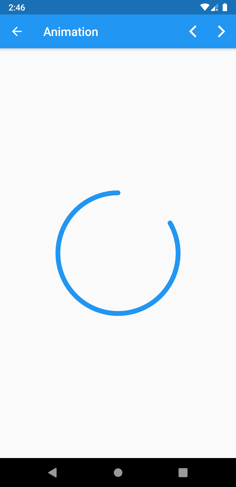
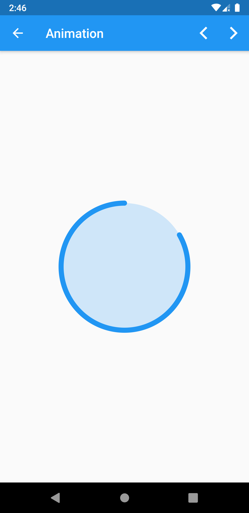
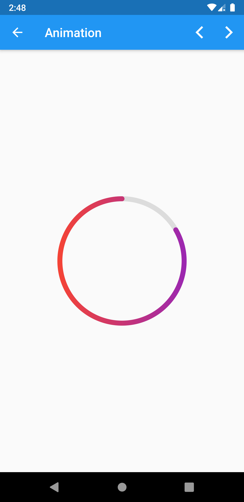

# XRadialProgress Widget
It's simply a radial progress that uses a CustomPaint as an extended class where we can draw circles, arcs, and much more.

## Usage
```
// class or file import
import ...;

class HomePage extends StatelessWidget {
  @override
  Widget build(BuildContext context) {
    // this [Center] widget can be wrapped by scaffold
    return Center(
      // specified widget
      child: XRadialProgress(
        progressValue: 0.3,
        color: Colors.blue,
        // other properties...
      ),
    );
  }
}
```

## Properties
- progressValue: a double progress value (0.0 - 0.1).
- progressValueInDegrees: an int progress value (0 - 360).
- color: which colors the circle progress.
- gradient: which gives a gradient instead of color.
- showBackCircle: whether to show the grey circle or not.
- isBackCircleFill: whether to fill the grey circle or not.
- backCircleColor: color of the grey [default] circle.
- width: the width of the stroke.
- child: a widget inside this radial progress.

## Preview
<p align="center">
  
  
  
  
</p>

## Enjoy
